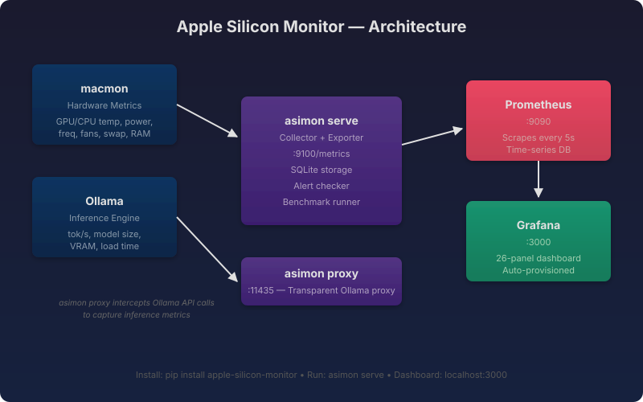
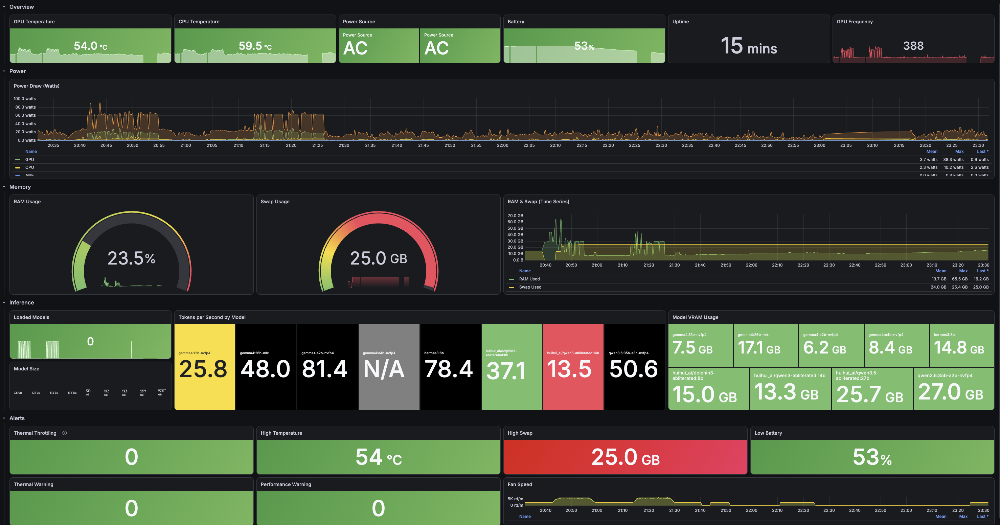

# Apple Silicon Monitor

[](LICENSE)
[](pyproject.toml)

Real-time hardware + inference monitoring for Apple Silicon LLMs. Collects GPU/CPU temps, power draw, swap, and Ollama inference metrics — then pipes them into a Grafana dashboard with 26 panels and alerting.

I built this because I wanted to see what my M1 Max was actually doing during LLM inference. `macmon` gives you a terminal snapshot, but I wanted time-series data. Prometheus + Grafana give me that, and `asimon` is the glue.

## Quick Start

```bash
pip install apple-silicon-monitor

# Start the metrics collector
asimon serve

# In another terminal, start the monitoring stack
brew install prometheus grafana
brew services start prometheus
brew services start grafana

# Open the dashboard
open http://localhost:3000
# Login: admin / admin
# Dashboard: "Apple Silicon Monitor" (auto-provisioned)
```

That's it. You'll see GPU temp, power draw, tok/s by model, swap pressure, and more — all updating in real time.

## Architecture



The collector (`asimon serve`) polls `macmon` for hardware metrics and the Ollama API for inference stats, stores them in SQLite, and exposes them as Prometheus metrics on port 9100. The transparent proxy (`asimon proxy`) sits between Ollama and your client on port 11435, capturing tok/s and model load data without changing anything.

## CLI Commands

| Command | Description |
|---------|-------------|
| `asimon serve` | Start headless collector + Prometheus exporter on port 9100 |
| `asimon collect` | Collect hardware metrics from macmon (stdout) |
| `asimon proxy` | Run the Ollama transparent proxy on port 11435 |
| `asimon clean` | Purge system memory and show before/after comparison |
| `asimon benchmark` | Run a benchmark suite against loaded models |

## What It Monitors

| Category | Metrics |
|----------|---------|
| **Temperature** | GPU temp, CPU temp, thermal throttling, thermal/performance warnings |
| **Power** | GPU/CPU/ANE/System power draw, power source (AC/Battery), battery % |
| **Memory** | RAM usage %, swap usage (GB), RAM+swap time series |
| **Inference** | Tokens/s by model, loaded models count, model size, model VRAM |
| **System** | Uptime, GPU frequency, fan speed (RPM) |

## Grafana Dashboard

The dashboard is auto-provisioned when Grafana starts. 26 panels across 5 sections:



Dashboard UID: `asimon-main` (for programmatic reference).

## Benchmark Data

This tool collects the data. For benchmark results and analysis, see the [apple-silicon-llm-guide](https://github.com/j3n0v4/apple-silicon-llm-guide) project.

Sample data from my M1 Max (64 GB) is in the [data/](data/) directory, including:

- Clean baseline benchmarks (4 models × 3 prompts)
- Swap impact analysis (dirty vs. clean memory)

## Test Hardware

| Component | Spec |
|-----------|------|
| Machine | MacBook Pro (16-inch, 2021) |
| SoC | Apple M1 Max |
| GPU cores | 32 |
| RAM | 64 GB unified |
| OS | macOS Sequoia 26.6 |
| Stack | asimon v0.1.0 + Prometheus + Grafana (Homebrew) |

I only have data for M1 Max 64 GB. If you're on a different config, run `asimon benchmark` and open a PR with your results.

## Configuration

All settings are controlled via environment variables with the `ASIMON_` prefix. Copy `.env.example` to `.env` and adjust:

| Variable | Default | Description |
|----------|---------|-------------|
| `ASIMON_POLLING_INTERVAL` | `1` | Seconds between samples |
| `ASIMON_OLLAMA_URL` | `http://localhost:11434` | Ollama API base URL |
| `ASIMON_PROXY_PORT` | `11435` | Ollama proxy port |
| `ASIMON_METRICS_PORT` | `9100` | Prometheus metrics port |
| `ASIMON_RETENTION_DAYS` | `7` | Data retention period |
| `ASIMON_DB_PATH` | `~/.asimon/data.db` | SQLite database path |

## Contributing

Contributions are welcome! This is a community project.

- **Benchmark data** — If you have different hardware (M2, M3, M4, different RAM configs), run `asimon benchmark` and open a PR with your results.
- **Bug reports** — Open an issue. Include your macOS version, hardware, and the output of `asimon collect`.
- **PRs** — Keep it focused. Run `make lint` and `make test` before opening.

## License

MIT — see [LICENSE](LICENSE).